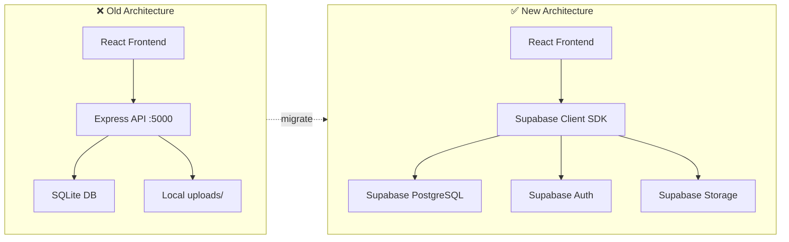

# Supabase Migration — COCS Production Migration

Migrate the Campus Operations Control System from local SQLite + Express to **Supabase** (PostgreSQL, Auth, Storage) with frontend deployed on **Vercel**.

## User Review Required

> [!IMPORTANT]
> **Supabase Project Required**: You must create a Supabase project at [supabase.com](https://supabase.com) and provide the project URL and anon key before execution begins. The free tier is sufficient for this project.

> [!WARNING]
> **Breaking Change**: The entire `server/` directory will become obsolete. The React frontend will talk directly to Supabase via the JS client SDK. No Express backend needed.

> [!CAUTION]
> **Data Migration**: Any existing work updates, issues, or audit records in the local SQLite database will need to be manually exported if you want to preserve them. The Supabase project starts fresh. Since this is still in development (demo data only), this is expected to be a clean migration.

## Open Questions

1. **Supabase credentials**: Do you already have a Supabase project created? If so, please share the `Project URL` and `anon public key` (safe to share — they're public). If not, I'll include setup instructions.
2. **Vercel deployment**: Do you have a Vercel account ready, or should I include setup instructions for that too?
3. **Demo accounts**: Should I keep the same demo emails (`admin@cocs.com`, `elec.mgr@cocs.com`, etc.) with `password123`?

---

## Architecture Change

| Layer | Old | New |
|-------|-----|-----|
| **Database** | SQLite (local file) | Supabase PostgreSQL (cloud) |
| **Auth** | Custom JWT + bcrypt | Supabase Auth (email/password) |
| **File Storage** | Local `uploads/` folder + multer | Supabase Storage bucket |
| **API** | Express REST routes | Direct Supabase JS SDK queries |
| **Backend Server** | Node.js + Express on port 5000 | **ELIMINATED** — no server needed |
| **Hosting** | `npm run dev` locally | Vercel (static deploy) |

---

## Proposed Changes

### Phase 1 — Supabase Schema & Security

#### [NEW] SQL Schema (run in Supabase SQL Editor)

Create all tables in Supabase PostgreSQL with proper types, constraints, indexes, and RLS policies.

**Tables:**
- `profiles` — user profile data (linked to `auth.users` via UUID)
- `departments` — 7 department records
- `locations` — 13 campus locations per department
- `work_updates` — work submissions with photo URLs
- `issues` — reported issues
- `audits` — admin audit records
- `activity_log` — action tracking

**Key design decisions:**
- Use `uuid` primary keys (Supabase standard) instead of integer autoincrement
- `profiles.id` references `auth.users.id` directly (1:1 mapping)
- `profiles.role` is `text CHECK (role IN ('Admin', 'Manager'))` — no Staff
- Photo URLs stored as Supabase Storage public URLs
- All timestamps use `timestamptz` (PostgreSQL timezone-aware)

**RLS Policies (6 tables × ~3 policies each):**
- Admin → full read/write on everything
- Manager → read/write scoped to own `department_id`
- All authenticated users → insert on work_updates, issues
- Only Admin → insert/read on audits

---

### Phase 2 — Frontend Restructure

#### [NEW] [supabaseClient.js](file:///c:/Users/ECE%20ME%20LAB/Desktop/New%20folder/client/src/utils/supabaseClient.js)
- Initialize `@supabase/supabase-js` client with env vars
- Single shared instance for the entire app

#### [DELETE] [api.js](file:///c:/Users/ECE%20ME%20LAB/Desktop/New%20folder/client/src/utils/api.js)
- Remove Axios-based API client (no longer needed)

#### [MODIFY] [AuthContext.jsx](file:///c:/Users/ECE%20ME%20LAB/Desktop/New%20folder/client/src/context/AuthContext.jsx)
- Replace custom JWT auth with `supabase.auth.signInWithPassword()`
- Listen to `onAuthStateChange` for session management
- Fetch user profile (role, department) from `profiles` table on login
- Auto-logout handled by Supabase session expiry

#### [MODIFY] [LoginPage.jsx](file:///c:/Users/ECE%20ME%20LAB/Desktop/New%20folder/client/src/pages/LoginPage.jsx)
- Use Supabase auth instead of `api.post('/auth/login')`
- Demo accounts still work (same emails, same password)

#### [MODIFY] [WorkUpdatePage.jsx](file:///c:/Users/ECE%20ME%20LAB/Desktop/New%20folder/client/src/pages/WorkUpdatePage.jsx)
- Upload photo → `supabase.storage.from('photos').upload()`
- Insert record → `supabase.from('work_updates').insert()`
- Fetch locations → `supabase.from('locations').select()` filtered by department

#### [MODIFY] [ReportIssuePage.jsx](file:///c:/Users/ECE%20ME%20LAB/Desktop/New%20folder/client/src/pages/ReportIssuePage.jsx)
- Same pattern: storage upload + table insert via Supabase SDK

#### [MODIFY] [MyTasksPage.jsx](file:///c:/Users/ECE%20ME%20LAB/Desktop/New%20folder/client/src/pages/MyTasksPage.jsx)
- Fetch work updates and issues via Supabase `.select()` with joins
- RLS automatically filters by department

#### [MODIFY] [VerifyPage.jsx](file:///c:/Users/ECE%20ME%20LAB/Desktop/New%20folder/client/src/pages/VerifyPage.jsx)
- Fetch pending work → `supabase.from('work_updates').select().eq('verified_status', 'Pending')`
- Update verification → `supabase.from('work_updates').update()`

#### [MODIFY] [DashboardPage.jsx](file:///c:/Users/ECE%20ME%20LAB/Desktop/New%20folder/client/src/pages/DashboardPage.jsx)
- Replace `api.get('/dashboard/stats')` with multiple Supabase queries
- Use `.select('count')` aggregations or a Supabase RPC function for complex stats

#### [MODIFY] [AuditPage.jsx](file:///c:/Users/ECE%20ME%20LAB/Desktop/New%20folder/client/src/pages/AuditPage.jsx)
- Insert audit → `supabase.from('audits').insert()`
- Fetch departments/locations → direct Supabase queries

#### [MODIFY] [Navbar.jsx](file:///c:/Users/ECE%20ME%20LAB/Desktop/New%20folder/client/src/components/Navbar.jsx)
- Logout → `supabase.auth.signOut()`

---

### Phase 3 — Cleanup

#### [DELETE] Entire `server/` directory
- All Express routes, middleware, SQLite database files
- No longer needed — Supabase handles everything

#### [DELETE] [docker-compose.yml](file:///c:/Users/ECE%20ME%20LAB/Desktop/New%20folder/docker-compose.yml)
- No longer needed — no backend to containerize

#### [DELETE] [start-cocs.bat](file:///c:/Users/ECE%20ME%20LAB/Desktop/New%20folder/start-cocs.bat)
- Replace with simple `npm run dev` in client directory

#### [MODIFY] [vite.config.js](file:///c:/Users/ECE%20ME%20LAB/Desktop/New%20folder/client/vite.config.js)
- Remove the `/api` proxy configuration (no backend)

#### [NEW] `.env.example`
- Document required Supabase environment variables

#### [MODIFY] [README.md](file:///c:/Users/ECE%20ME%20LAB/Desktop/New%20folder/README.md)
- Complete rewrite for Supabase architecture

---

## File Change Summary

| Action | Count | Files |
|--------|-------|-------|
| **NEW** | 3 | `supabaseClient.js`, `.env.example`, `supabase-schema.sql` |
| **MODIFY** | 10 | AuthContext, LoginPage, WorkUpdatePage, ReportIssuePage, MyTasksPage, VerifyPage, DashboardPage, AuditPage, Navbar, README |
| **DELETE** | ~15 | Entire `server/` dir, docker-compose, start-cocs.bat, api.js |

---

## Verification Plan

### Automated Tests
1. Run `npm run build` — ensure zero build errors
2. Run `npm run dev` — verify app loads at localhost:5173

### Manual Verification
1. **Login**: Test Admin and Manager demo accounts
2. **Work Update**: Submit with photo upload → verify in Supabase Storage bucket + database record
3. **Issue Report**: Submit → verify in database
4. **Verify Page**: Manager approves/rejects → check `verified_status` updates
5. **Dashboard**: Admin sees correct aggregated stats
6. **RLS**: Login as Manager → confirm they CANNOT see other department's data
7. **Deploy**: Push to Vercel → verify production URL works

### Security Verification
- Attempt cross-department data access via browser console → should be blocked by RLS
- Attempt to access dashboard stats as Manager → should return empty/forbidden
